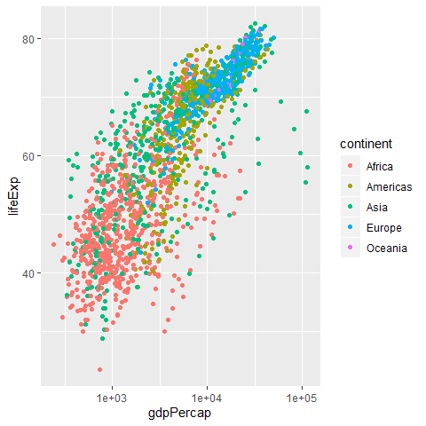

# Introduction

Here is my first RMarkdown (rmd) document. Because toc is yes any hashtag appears as the table of contents

# Let's embed some R code

First, let's write an R chunk that loads the tidyverse package and then reads in the Gapminder data set from the data subdirectory of the project. 

To create a new R chunk: CTRL + ALT + I


```r
library(tidyverse)
```

```
## -- Attaching packages -------------------------------------------------------------------------------- tidyverse 1.2.1 --
```

```
## v ggplot2 3.2.1     v purrr   0.3.2
## v tibble  2.1.3     v dplyr   0.8.3
## v tidyr   1.0.0     v stringr 1.4.0
## v readr   1.3.1     v forcats 0.4.0
```

```
## -- Conflicts ----------------------------------------------------------------------------------- tidyverse_conflicts() --
## x dplyr::filter() masks stats::filter()
## x dplyr::lag()    masks stats::lag()
```

```r
gm <- read.csv("Data/gapminder.csv")
```

# Investigate gm data

What will it show us????


```r
head(gm)
```

```
##       country continent year lifeExp      pop gdpPercap
## 1 Afghanistan      Asia 1952  28.801  8425333  779.4453
## 2 Afghanistan      Asia 1957  30.332  9240934  820.8530
## 3 Afghanistan      Asia 1962  31.997 10267083  853.1007
## 4 Afghanistan      Asia 1967  34.020 11537966  836.1971
## 5 Afghanistan      Asia 1972  36.088 13079460  739.9811
## 6 Afghanistan      Asia 1977  38.438 14880372  786.1134
```


# Our first plot

Shows gdp per capita on x and life expectancy on y


```r
ggplot(gm, aes(x = gdpPercap, y = lifeExp)) + geom_point()
```


# A better plot


```r
ggplot(gm, aes(x = gdpPercap, y = lifeExp)) +
  geom_point(aes(col = continent)) +
  scale_x_log10()
```



#Alternative chunk options

Options include:
- echo (TRUE by default), etlls whether to include code in the output
- results 
  - hide will hide the reuslts wow!
  - hold will hold results until end of the r chunk
- include (TRUE by default) if FALSE then code will not run aka be evaluated
- fig.width fig.height dimensions of figure in output
- cache (FALSE by default) if TRUE saves result from R chunk

# Table in RMarkdown

Preview the ata using head function


```r
head(gm)
```

```
##       country continent year lifeExp      pop gdpPercap
## 1 Afghanistan      Asia 1952  28.801  8425333  779.4453
## 2 Afghanistan      Asia 1957  30.332  9240934  820.8530
## 3 Afghanistan      Asia 1962  31.997 10267083  853.1007
## 4 Afghanistan      Asia 1967  34.020 11537966  836.1971
## 5 Afghanistan      Asia 1972  36.088 13079460  739.9811
## 6 Afghanistan      Asia 1977  38.438 14880372  786.1134
```

now head funciton as a nice and neat formatted table


```r
library(knitr)
kable(head(gm))
```


country       continent    year   lifeExp        pop   gdpPercap
------------  ----------  -----  --------  ---------  ----------
Afghanistan   Asia         1952    28.801    8425333    779.4453
Afghanistan   Asia         1957    30.332    9240934    820.8530
Afghanistan   Asia         1962    31.997   10267083    853.1007
Afghanistan   Asia         1967    34.020   11537966    836.1971
Afghanistan   Asia         1972    36.088   13079460    739.9811
Afghanistan   Asia         1977    38.438   14880372    786.1134

If you (me) like tables, look at the **gt** table *package*


